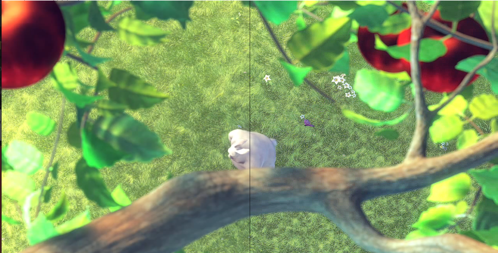

# amd_fsr

Implementation of AML FSR Cross Platform for Image Upscaling

### Motivation
Try to port this library Cross Platform, currently using Windows API and Direct3D 11

https://github.com/GPUOpen-Effects/FidelityFX-CLI

https://github.com/GPUOpen-Effects/FidelityFX-FSR

### Limitation
Currently only support FSR 1

https://github.com/GPUOpen-Effects/FidelityFX-CLI/issues/16

## Vulkan Implementation
In Progress inside vulkancpp folder.

## Python Implementaion with modernGL

Refer to the python folder, for more documentation

Shaders file and source can be located on the python/shaders.

## WebGL Implementaion with glea + vkBasalt

Refer to the web folder, for more documentation

shaders is based on vkBasalt implementation for CAS.

## Sample Demo
Before and after CAS shaders applied.

