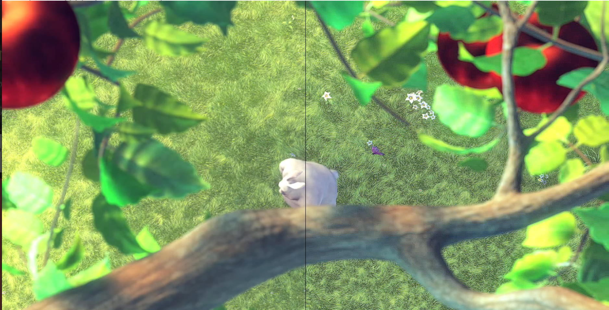

### WebGL Implementation for AMD CAS.

GLSL Source : https://github.com/DadSchoorse/vkBasalt/blob/master/src/shader/cas.frag.glsl

Project is based from:

https://github.com/DadSchoorse/vkBasalt for the glsl shaders
https://github.com/BenjaminWegener/AMD-fidelityFX-SuperResolution-webGL for the webGL Implementation

Picture demo before and after CAS applied.

